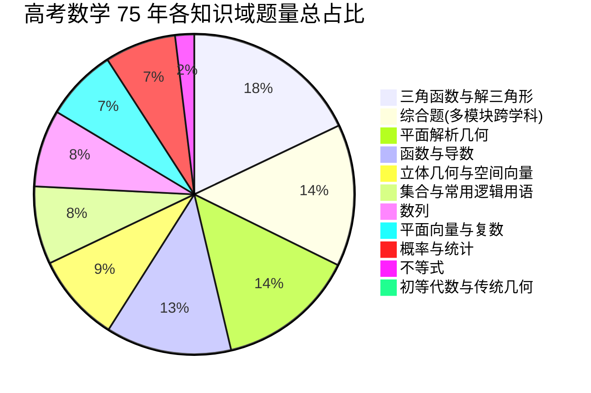

# 1952～2026年中国高考数学真题全景数据分析与命题演进白皮书

> **数据基底**：本分析报告基于 GitHub `gaokaomath` 历年真题库及衍生 LaTeX 结构化工程，覆盖 **1952 年至 2026 年（跨度 75 年）** 统考及各省自主命题共计 **775 套试卷**、**16,273 道独立试题**，并对其中 **15,744 道试题（96.7%）** 配备了详尽步骤解答，深度抽取并打标 3,523 幅原题及重绘矢量图形。

---

## 目录
1. [宏观数据概貌与历史分期](#1-宏观数据概貌与历史分期)
2. [五大历史时期命题哲学与演进轨迹](#2-五大历史时期命题哲学与演进轨迹)
3. [学科知识图谱与核心考点权重变迁](#3-学科知识图谱与核心考点权重变迁)
4. [试卷结构、题型格局与分值分配的历史流变](#4-试卷结构题型格局与分值分配的历史流变)
5. [全国卷与地方自主命题省份风格多维对比](#5-全国卷与地方自主命题省份风格多维对比)
6. [高考数学压轴题核心模型与高阶思维剖析](#6-高考数学压轴题核心模型与高阶思维剖析)
7. [图文题库可拆分、可改编、可组卷体系设计与实践](#7-图文题库可拆分可改编可组卷体系设计与实践)

---

## 1. 宏观数据概貌与历史分期

### 1.1 数据体量全景
- **总收录试卷数**：775 套（普通高考 709 套，春季高考 66 套）
- **总试题数量**：16,273 题
- **解答与解析覆盖率**：96.7%（15,744 题含完整推理过程）
- **插图与矢量绘图数**：3,523 幅（涵盖函数图象、立体几何投影、直方图、平面圆锥曲线）
- **年份跨度**：1952 年 ～ 2026 年（75 年历程）

### 1.2 历史时期与试题存量统计表

| 历史发展阶段 | 起止年份 | 试卷套数 | 题目总数 | 客观题均比 | 核心命题特征与导向 |
| :--- | :---: | :---: | :---: | :---: | :--- |
| **一、建国探索期** | 1952-1965 | 25 | 204 | 0% ~ 5% | 苏联体系主导，重初等代数与传统欧氏几何综合证明，全卷仅 6~8 道大题，计算繁重。 |
| **二、恢复与过渡期** | 1977-1984 | 69 | 734 | 10% ~ 20% | 1977 年分省命题后迅速统一全国卷，重视恢复教学秩序，紧扣教材基本功与运算能力。 |
| **三、标准化与 3+2 期** | 1985-1999 | 71 | 1,935 | 45% ~ 55% | 广东率先启动标准化改革，选择填空客观题成型，文理明确分卷，能力立意崛起。 |
| **四、新课标与自主命题繁荣期**| 2000-2019 | 544 | 11,978 | 50% ~ 60% | 16省市自主命题，微积分导数与现代统计成为核心，形成经典解答题“六大题”格局。 |
| **五、新高考深化期** | 2020-2026 | 66 | 1,422 | 58% ~ 65% | 文理合卷，引入创新多选题与 19 题卷面结构，强调素养立意、情境化真实应用与思维开放性。 |

---

## 2. 五大历史时期命题哲学与演进轨迹

### 2.1 建国探索期（1952—1965）：苏式体系与高强度纯演绎证明
- **历史背景**：1952 年新中国建立统一高考制度，全面吸纳苏联普通中学数学教学大纲。
- **命题特点**：
  1. **题量小、分值集中**：整张试卷仅 6 至 8 道综合大题，单题分值 12~20 分。
  2. **初等代数与多项式变形为王**：强调高次代数方程、整式因式分解、韦达定理推广、二项式定理、根式有理化与对数繁复查表计算。
  3. **立体几何以公理化纯几何证明为主**：完全依赖传统辅助线、三垂线定理、截面割补法计算体积，无空间直角坐标系与向量工具。
- **代表试题**：1952年全国卷第1题（多项式因式分解与化简）、1958年北京卷（四面体综合几何性质证明）。

### 2.2 恢复与过渡期（1977—1984）：百废待兴与基础重建
- **历史背景**：1977 年邓小平同志拍板恢复高考，由于时间仓促，1977 年由各省市单独命题，1978 年起迅速恢复全国统一试卷。
- **命题特点**：
  1. **重视“三基”（基础知识、基本技能、基本思想方法）**：题干平实精炼，考查对初高中基础概念的掌握。
  2. **平面解析几何地位确立**：直线与圆、椭圆与双曲线标准方程成为必考重点，开始出现简单的代数与几何融合题。
  3. **题量逐渐增加**：由纯大题逐步向“小题考基础、大题考思维”转变，出现了简答题与填空题。

### 2.3 标准化与 3+2 改革期（1985—1999）：题型标准化与能力立意
- **历史背景**：1985 年广东率先试点高考标准化改革，1989 年在全国推广；上海开始自主命题；1993 年起全面推行“3+2”考试科目组。
- **命题特点**：
  1. **单项选择题全面确立**：全卷设立 10~15 道单项选择题（占 40~65 分），极大提升了全卷知识点覆盖面与机器阅卷客观性。
  2. **文理分科数学命题常态化**：文科卷注重基础与计算，理科卷强调抽象空间想象与严密逻辑推理。
  3. **压轴题以“解析几何”与“数列不等式”双雄并立**：解析几何涉及繁杂的韦达定理与直线圆锥曲线联立；数列压轴题常与数学归纳法、放缩法结合，淘汰率高、区分度强（如著名的 1999 年高考全国卷数列压轴题）。

### 2.4 新课标与自主命题繁荣期（2000—2019）：多元探索与六大核心板块定型
- **历史背景**：2004 年起，北京、天津、上海、江苏、浙江、广东、山东等 16 省市开启自主命题；高中新课程改革全面实施。
- **命题特点**：
  1. **微积分与导数革命**：导数正式进入高中教材，迅速取代传统初等代数函数极值，成为选择填空压轴与最后一道解答题的绝对主角。
  2. **空间向量引入立体几何**：建立空间直角坐标系求解法向量与面面角，大幅降低了传统作辅助线的思维门槛，转向考查空间代数化运算能力。
  3. **概率与数理统计地位跃升**：离散型随机变量分布列、数学期望与方差、回归分析与正态分布成为必考大题。
  4. **“六大解答题”经典版图形成**：
     $$\text{解答题} \Longrightarrow \begin{cases} \text{三角函数与解三角形 / 数列 (中档)} \\ \text{立体几何与空间向量 (中档)} \\ \text{概率与统计 (中档)} \\ \text{平面解析几何 (较难)} \\ \text{函数与导数 (压轴)} \end{cases}$$

### 2.5 新高考与立德树人一体化期（2020—2026）：文理合卷、素养立意与创新开放
- **历史背景**：新高考（“3+1+2”与“3+3”选考模式）全面落地，2020 年新高考全国卷亮相，2025-2026 年新高考改革全面收官。
- **命题特点**：
  1. **文理合卷**：不再区分文科数学与理科数学，全省考生同卷竞技，试卷梯度与区分度设计更具层级性。
  2. **题型结构颠覆性变革**：
     - 引入 **多选题（共 3~4 题，每题 5~6 分）**：选对所有选项满分，漏选得部分分，错选或多选不得分，极强考查全面分析能力。
     - 2024~2026 年推行 **19 题新题型结构**（8 单选 + 3 多选 + 3 填空 + 5 解答），题量压缩，为深度思考留出充裕时间。
  3. **情境化与现实建模**：深度融合航空航天、芯片制造、医药临床试验、生态碳中和、体育竞技等真实科技生活情境。
  4. **高阶数学思维背景下沉**：隐零点、极值点偏移、泰勒展开切线放缩、拓扑图论、数列递推与数论同余思想频频进入压轴题第 19 题。

---

## 3. 学科知识图谱与核心考点权重变迁

根据题库 16,273 道试题的数据归因，高中数学十大一级知识域题量与占比分布如下：



### 3.1 各核心模块的历史演变特征

#### (1) 函数与导数（从“初等函数”到“微积分分析工具”）
- **1952-1999 年**：主要考查初等函数的定义域、值域、单调性与奇偶性，最值依靠配方法、判别式法或单调性判断。
- **2000-2026 年**：导数引入后，成为分析函数形态的核心手段。近年来，**极值点偏移**（如利用 $x_1+x_2$ 对称化构造）、**隐零点代换**、**双变量构造**、**凹凸反转切线放缩**（如 $\ln x \le x-1$, $e^x \ge x+1$）成为新高考压轴命题的常态。

#### (2) 平面解析几何（代数运算能力的“试金石”）
- **75 年贯穿不变的高频模块**（占比达 13.89%）。
- 命题热点从早期的抛物线准线几何性质，演进为现代圆锥曲线综合大题：**直线与椭圆/抛物线联立**、**韦达定理**、**弦长公式**、**定点与定值问题**、**动点轨迹与面积最值**。
- **命题趋势**：淡化极度繁复的“硬算死算”，转向考查**几何特征代数化**与**对称性化简策略**（如点差法、仿射变换思想、参数极坐标辅助）。

#### (3) 概率与统计（增长最为迅猛的现代数学分支）
- **1952-1985 年**：占比不足 1%，几乎仅偶见简单的古典概型。
- **2000-2026 年**：从传统排列组合演进为涵盖现代数据科学的完整考查体系：
  - 频率分布直方图与分位数计算
  - 条件概率、全概率公式与贝叶斯公式（2020年后全国卷多次大题考查）
  - 二项分布与超几何分布期望方差
  - 成对数据线性回归与 $2\times 2$ 列联表独立性检验

---

## 4. 试卷结构、题型格局与分值分配的历史流变

| 演进指标 | 1952-1977 年 | 1985-1999 年 | 2000-2019 年 | 2020-2026 年 (新高考) |
| :--- | :---: | :---: | :---: | :---: |
| **总题量** | 6 ~ 10 题 | 20 ~ 25 题 | 21 ~ 24 题 | **19 题** |
| **单选题** | 0 题 | 12 ~ 15 题 (45~60分) | 12 题 (60分) | **8 题 (40分)** |
| **多选题** | 无 | 无 | 无 | **3 ~ 4 题 (18~20分)** |
| **填空题** | 0 ~ 2 题 | 4 题 (16分) | 4 题 (16~20分) | **3 题 (15分)** |
| **解答题** | 6 ~ 8 题 | 5 ~ 6 题 | 6 题 (70~74分) | **5 题 (77分)** |
| **选做题机制**| 无 | 部分省份二选一 | 极坐标/不等式选做(10分)| **全面取消选做，全卷必做** |
| **文理分科** | 文理不分 | 文理严格分卷 | 文理严格分卷 | **文理合卷，统一标准** |

---

## 5. 全国卷与地方自主命题省份风格多维对比

根据对各省份 775 套试卷的大数据画像分析，不同命题主体形成了鲜明的地域数学考查风格：

```
                [思维开放与创新性]
                        ▲
                        │     ★ 新高考全国I/II卷
                        │     ★ 浙江卷
                        │
    ★ 江苏卷 (硬核推理)   │
                        │             ★ 北京卷 (大气通透)
◄───────────────────────┼────────────────────────► [基础扎实与直观呈现]
                        │
                        │     ★ 全国甲/乙卷
                        │     ★ 上海卷 (代数严密/高等数学)
                        │
                        ▼
                [古典运算与深度严谨]
```

1. **新高考全国卷（全国I/II卷）**：
   - **特点**：全方位兼顾基础覆盖与拔尖创新，压轴题第 19 题立意高远，常带有高阶数学理论（图温、数列分划、拓扑变换）的初等化背景。
2. **江苏卷（2004-2020 历史卷）**：
   - **特点**：“江苏数学”曾以超高难度和灵活构思闻名，不设选择题（全卷填空+大题+附加题），对三角恒等变换、立体几何空间向量和数列裂项放缩要求登峰造极。
3. **北京卷**：
   - **特点**：注重数学本质理解与逻辑思维，题目文字表述现代规范，强调“多思少算”，最后一道数列创新题通常考查集合划分与数论性质。
4. **上海卷**：
   - **特点**：承袭海派精细化命题传统，填空题占比极大，注重矩阵、行列式、算法框图与微积分思想的前瞻渗透。
5. **浙江卷**：
   - **特点**：构思极其精巧，选择填空压轴与导数解答题常常需要深刻的数形结合与极值洞察力。

---

## 6. 高考数学压轴题核心模型与高阶思维剖析

### 6.1 导数压轴题三大经典范式
1. **极值点偏移与对称化构造**：
   - *模型背景*：若 $f'(x_1)=f'(x_2)=0$ 或 $f(x_1)=f(x_2)$，证明 $x_1+x_2 > 2x_0$ 或 $x_1 x_2 > x_0^2$。
   - *解题通法*：对称中心化变元，构造差函数 $F(x) = f(x) - f(2x_0-x)$，利用导数判定单调性。
2. **隐零点设而不求与整体代换**：
   - *模型背景*：导函数 $f'(x)=0$ 的根 $x_0$ 无法用初等式精确写出，但满足超越方程 $g(x_0)=0$。
   - *解题通法*：将 $x_0$ 设出，代入原函数消除超越项（如将 $e^{x_0}$ 或 $\ln x_0$ 替换为代数式），构造新函数求单调性或范围。
3. **切线放缩与恒成立分离**：
   - *核心不等式链*：$e^x \ge x+1$（在 $x=0$ 处切线放缩）、$\ln x \le x-1$（在 $x=1$ 处切线放缩）、$\sin x \le x$。

### 6.2 解析几何定点定值四大策略
1. **设线联立与韦达代换**：设直线 $x = my + n$，联立椭圆后用 $y_1+y_2$ 与 $y_1 y_2$ 表达几何关系。
2. **定比分点与仿射变换**：利用仿射变换将椭圆压缩为圆，利用圆的对称性瞬间求出定点与定值。
3. **点差法与中点弦性质**：对于弦中点问题，两点代入曲线方程相减，建立中点坐标与弦斜率的关系。

---

## 7. 图文题库可拆分、可改编、可组卷体系设计与实践

为实现真题资源的教育教学最大化赋能，本系统构建了全要素数据标准：

### 7.1 原子化题库数据结构（UID 体系）
每道试题分配全局唯一索引，例如：
`GK-2026-national_1-01`：2026 年新高考全国 I 卷第 1 题
包含结构化字段：
- 题干标准 LaTeX 源码（支持 KaTeX 毫秒级无损渲染）
- 选项独立解构数组 `[A, B, C, D]`
- 独立详细解答（官方解析、步骤分值）
- 知识域与多级标签、考查思想方法、难度系数预估
- 题目插图与矢量重绘图的物理与相对映射

### 7.2 试题改编（Adaptation）工坊机制
1. **参数化变量扰动**：提取解析式中的关键常量参数（如椭圆焦点距离、函数指数项底数），自动生成同类同质题。
2. **逆向探究改编**：将“已知参数求极值”改编为“已知极值逆求参数取值范围”。
3. **跨情境迁移**：将抽象概率题迁移至芯片制造、空间站太阳能电池板寿命等新高考科技情境。

### 7.3 智能动态组卷引擎（Composer）
- **一键智能配比**：支持“新高考 19 题模式”、“大纲 22 题模式”、“小题限时练”、“微专题突破卷”。
- **难度雷达动态平衡**：组卷时实时计算试卷预估难度（易:中:难 比例，如推荐 3:5:2 标准）。
- **多端导出能力**：一键生成“学生标准答卷（无答案打印版）”、“教师详析讲义（含解答步骤与考点批注）”以及 LaTeX / Markdown 工业排版源文件。

---
*报告生成单位：高考数学真题全景分析与题库数字化研发工程*  
*数据版本：1952-2026 年完整版*
